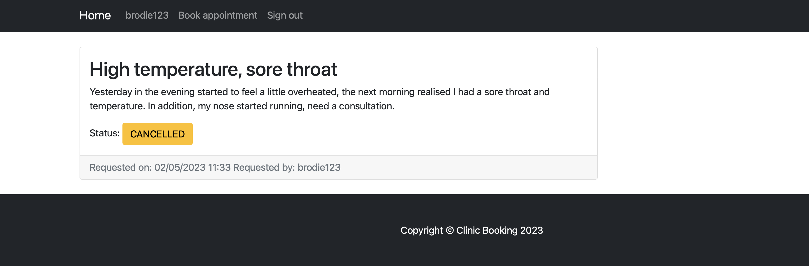

## SmartBooking


---

A small clinical booking system for arranging booking, that are selected from a list of available dates.

### Usage
___

1. Download the latest release of the project
2. Download [Apache Tomcat v.9](https://tomcat.apache.org/download-90.cgi) and extract it any
3. Download [Postgres](https://www.postgresql.org/download/) and install in on the local machine
4. Open the latest release (source code) inside the Intellij IDEA and do the following setup:
   * inside `pom.xml`, change the configuration for the `maven-war-plugin` to the `/webapps` folder inside of your Tomcat installation location:
   ```
    <plugin>
      <artifactId>maven-war-plugin</artifactId>
      <version>3.2.2</version>
      <configuration>
        <!-- /webapps directory inside your Tomcat installation folder -->
        <outputDirectory>/Users/nikitakorolev/Desktop/Spring_Java/Spring/tomcat/apache-tomcat-9.0.71/webapps</outputDirectory>
      </configuration>
    </plugin>
   ```
    * using the DB Browser plugin inside Intellij IDEA, create a new database and initialize a connection (by giving database name, username and password);  
      if you are using a `pgsql` CLI, create a database and run `schema.sql`, located at `/src/main/java/resources`
    * inside `org.clinic.config.DataConfig`, change the database URL, USERNAME and PASSWORD strings to ones applicable to your database
    * run the application and upon Tomcat startup test `localhost:8080/clinic-booking-webapp/main`, login page should appear
    
    
### Description
___
As a primary principle for business logic, bookings are handled by a group of admins/moderators.
Whenever the user requests a booking, an admin should approve (on his version of main page). After approval 
the new booking status will be viewed (user version of the main page). Same principle works for the cancellation 
of requested booking. 

The screens below demonstrate the correct sequence of using the application's logic:

Login => Request Booking => Approve Booking => Cancel Booking => Approve Cancellation


1. Login
  


2. Request Booking
  
  
  
  
   
3. Approve Booking
  
  
 


4. Cancel Booking


5. Approve Cancellation



### Technological stack
___
Project is implemented with stack described below.

Back-end:
* Java 17 (core language for implementation)
* Maven (build system)
* Postgres as database
* [Spring Framework](https://spring.io) (Core, Spring Data JPA, Spring Web, Spring Security) for general infrastructure

Front-end:
* [Start Bootstrap](https://startbootstrap.com) (based on bootstrap) for main content of the views and their CSS
* [Thymeleaf](https://www.thymeleaf.org) (as a template engine) in order to pass data into pages, as well as authorization

### Contacts
___
You can reach me at:

* [LinkedIn](https://www.linkedin.com/in/nikita-korolev-6996b523a/)
* [Instagram](https://www.instagram.com/nk25.dev/)
* email me at nk25.dev@gmail.com
